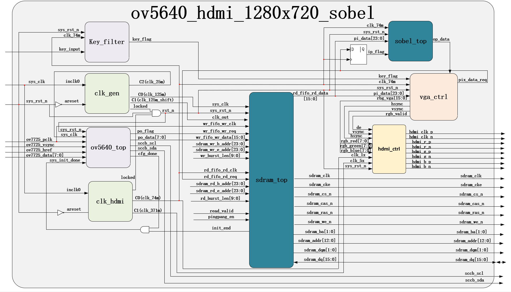
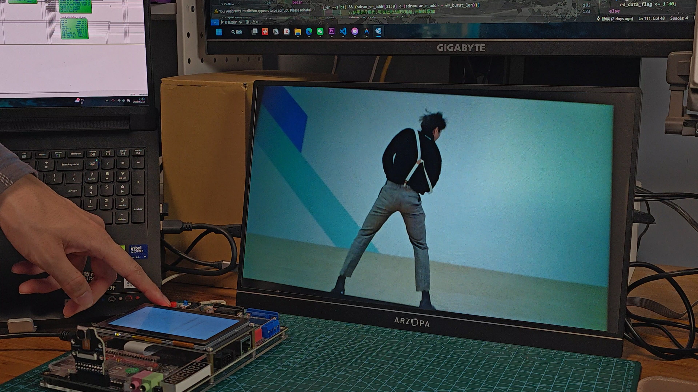
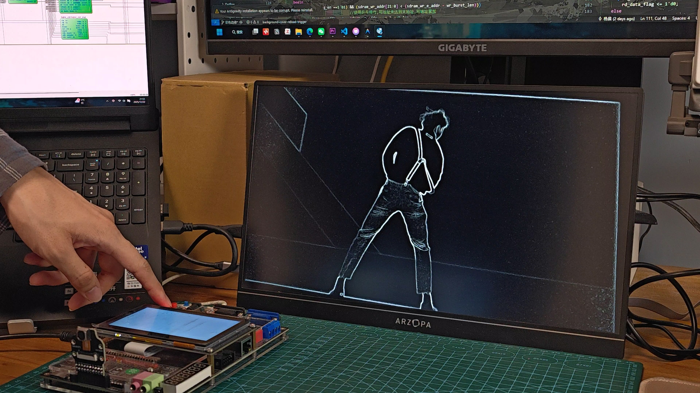
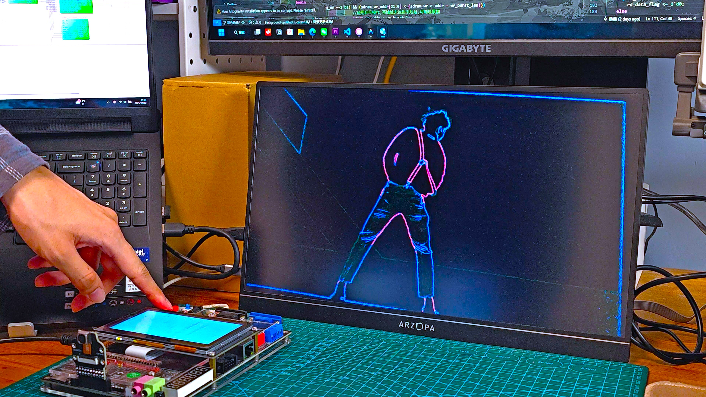

# FPGA_Sobel

> **基于 FPGA 的 Sobel 边缘检测项目** — 使用 OV5640 摄像头采集图像，FPGA 实时处理并通过 HDMI 输出显示结果。

---

## 📌 项目概述

本项目实现了一个基于 **野火征途FPGA开发板** 的实时图像处理链路，主要功能为对摄像头采集的图像做 Sobel 边缘检测并通过 HDMI 输出处理后的视频流。

- **输入**：OV5640 摄像头（RGB565）
- **输出**：HDMI 视频输出（1280x720 等分辨率可配置）
- **实时性**：基于流水线的像素级处理

## 📂 目录结构（简述）

- `project/` — Quartus 工程文件与编译输出（.qpf, .qsf, .jic 等）
- `rtl/` — Verilog/VHDL 源代码（包含 `ov5640_hdmi_1280x720.v`, `vga_ctrl.v`, `sobel/` 子模块等）
- `sim/` — 仿真文件与测试平台（ModelSim/Questa 仿真脚本与波形）
- `doc/` — 项目相关文档与原理图
- `ip_core/`、`db/` 等 — 工具生成/供应的 IP 与数据库文件

## 💡 设计说明

### 模块划分

- `ov5640`：摄像头配置与数据采集（I2C 配置，摄像头并/串行输出接收）
- `vga_ctrl`：时序生成与帧缓冲控制
- `sobel`：Sobel 算子实现（行缓冲、窗口计算、阈值/非线性处理）
- `hdmi`：TMDS 编码与 HDMI 输出驱动

### 系统框图

### 运行结果

  <figure style="flex:1; text-align:center; margin:0; padding:4px; box-sizing:border-box;">
    
    <figcaption style="margin:4px 0 0; font-size:0.95em;">RAW Data</figcaption>
  </figure>
  <figure style="flex:1; text-align:center; margin:0; padding:4px; box-sizing:border-box;">
    
    <figcaption style="margin:4px 0 0; font-size:0.95em;">Sobel</figcaption>
  </figure>
  <figure style="flex:1; text-align:center; margin:0; padding:4px; box-sizing:border-box;">
    
    <figcaption style="margin:4px 0 0; font-size:0.95em;">赛博风格</figcaption>
  </figure>

## ✅ 特性与亮点

- 实时 Sobel 边缘检测
- 按键切换显示模式
- 模块化设计，便于移植与扩展
- 支持 Quartus/ModelSim 工具链的综合与仿真

## 🛠 构建与运行（简要）

1. 使用 Quartus 打开 `project/` 中的 `.qpf` 工程文件。
2. 根据目标开发板调整 `qsf` 中的引脚约束（摄像头/HDMI/时钟/DDR）。
3. 编译并生成配置文件（.jic / .sof），使用编程器下装到 FPGA。
4. 连接 OV5640 摄像头并上电，观察 HDMI 输出。

## 🔧 注意事项
- 没有进行滤波，有比较明显的噪点
- sobel处理后的数据有延迟

## 📄 版权与许可

本项目采用 **MIT 许可证**
